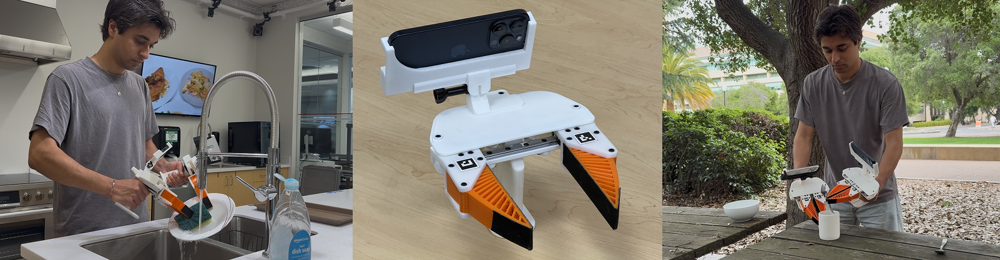
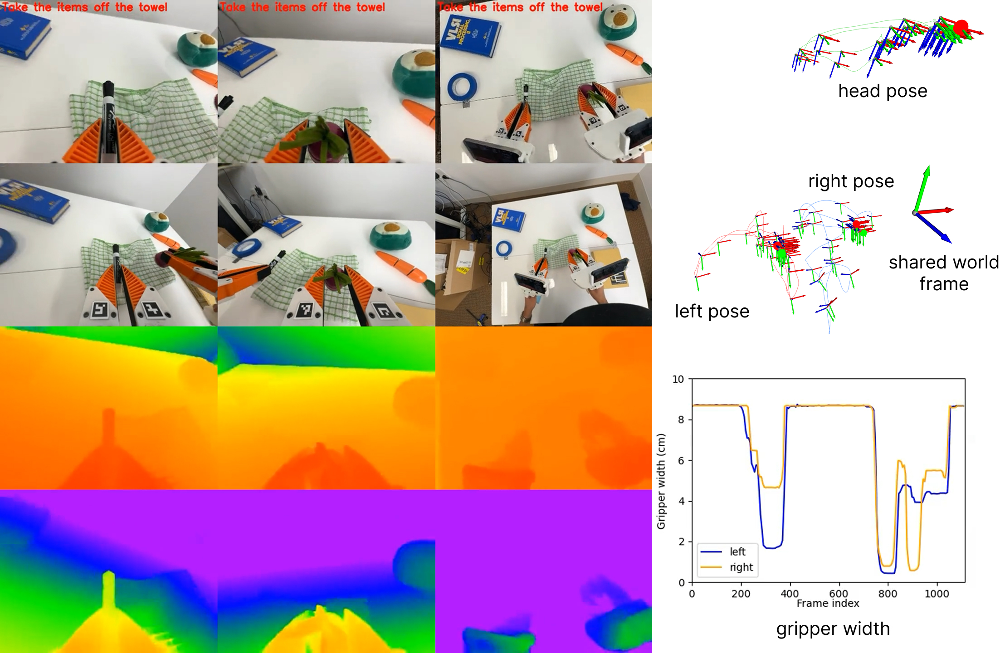

# iPhUMI
Pronounced: "eye-foo-me"

iPhUMI is a handheld data collection interface for training visuomotor robot manipulation policies as well as a hardware interface for [behavior prompting](https://behavior-prompting.github.io/).

Contact for support: [Austin Patel](https://austinapatel.github.io/)





## About

iPhUMI is adapted from the original [UMI](https://umi-gripper.github.io/) design with one change: we replace the GoPro with an iPhone.

We highlight three key benefits:

1. **Ease-of-use** - Our iPhUMI app provides an intuitive interface to specify task labels, collect data, and export data for processing. It's very easy to adapt existing UMI grippers to become iPhUMI grippers, just 3D print two parts.
2. **Localization** - Real-time gripper localization allows you to collect UMI data with minimal setup time in diverse in-the-wild environments. You can pair multiple iPhones in a bimanual setup to enable multi-view tracking with a shared world coordinate frame.
3. **Extensibility** - The iPhUMI app is open-source, allowing you to modify the data collection process for your additional sensors and requirements. The codebase supports adding custom gripper designs beyond our provided design.

This repository contains both iOS application code in `ios_app` and an associated `iphumi` Python package for post-processing the data in `python_package`.

## Key Features
- **Data collection** interface to collect demonstrations with task labels (either manually specified or through language narration). We also support bimanual data collection, with an optional third iPhone for head tracking.
- **Data management** interface to view/delete/export your collected data to a SD card.
- **Deployment streaming** interface for deploying iPhUMI policies on a robot using the iPhone mounted to the robot (USB and Ethernet streaming are supported).
- **Data post processing** Python scripts to generate a multi-task zarr dataset containing the iPhUMI data and visualization scripts to view your data.

## Documentation
### [Usage guide](docs/usage.md) - Follow this guide to get started with iPhUMI

## Checkpoints
[Gated Memory Policy](https://github.com/real-stanford/gated-memory-policy) has released an in-the-wild iPhUMI checkpoint you can deploy for a cup placement task in your environment.

## iPhUMI Data Initiaitve
iPhUMI data, like all UMI data, is better when universally sharable! Please contribute your iPhUMI data to be listed on the [UMI Data Initiative](https://umi-data.github.io/) for others to use.

## Contributing
We welcome contributions, such as phone mounts for different iPhone models, additional gripper designs, or new software features!

## Research projects using iPhUMI
We will update this list to highlight other research projects that are using iPhUMI. Contact [Austin Patel](https://austinapatel.github.io/) if you would like to be added.

- [Gated Memory Policy, Gao et. al., 2026](https://gated-memory-policy.github.io/) (Memory-based diffusion policy with iPhUMI in-the-wild experiments)
- [HoMMI: Learning Whole-Body Mobile Manipulation from Human Demonstrations](https://hommi-robot.github.io/), Xu et. al., 2026 (Mobile manipulation visuomotor policy learned from bimanual iPhUMI + head mounted iPhone)
- [In-the-Wild Compliant Manipulation with UMI-FT](https://umi-ft.github.io/), Choi et. al., 2026 (Force-torque visuomotor policy with iPhUMI)

## Acknowledgements
We thank the following people for their contributions that helped make this project possible:
- Yihuai Gao for the [pypeertalk](https://github.com/yihuai-gao/pypeertalk) library for iPhone USB streaming as well as for adding USB streaming to iPhUMI.
- Xiaomeng Xu for adding head-mounted data collection as part of her [HoMMI](https://hommi-robot.github.io/) project.
- Zeyi Liu, et. al, for the [ManiWAV](https://maniwav.github.io/) project which is the foundation for contact mic support on iPhUMI.
- Cheng Chi, Zhenjia Xu, et. al., for the [original UMI](https://umi-gripper.github.io/) project

## Citation
If you found iPhUMI useful in your research, please cite [Behavior Prompting Policy](https://behavior-prompting.github.io/):

```
@article{patel2026bpp,
  title={Behavior Prompting Policy: Demonstrations as Prompts for Manipulation}, 
  author={Austin Patel and Ben Pekarek and Joel Enrique Castro Hernandez and Shuran Song},
  year={2026},
  journal={arXiv preprint arXiv:2606.30457},
  url={https://arxiv.org/abs/2606.30457}
}
```

If you leverage the head-mounted support or any of the [HoMMI](https://hommi-robot.github.io/) features, please additionally cite:
```
@article{xu2026hommi,
	title={HoMMI: Learning Whole-Body Mobile Manipulation from Human Demonstrations},
	author={Xu, Xiaomeng and Park, Jisang and Zhang, Han and Cousineau, Eric and Bhat, Aditya and Barreiros, Jose and Wang, Dian and Song, Shuran},
	journal={arXiv preprint arXiv:2603.03243},
	year={2026}
}
```

## License
This repository is released under the MIT license. See [LICENSE](LICENSE) for more details.

## TODO
- [ ] release support for wireless behavior prompting transfer