# iPhUMI Usage Guide
This guide details the process of building an iPhUMI gripper, collecting demonstrations, converting demonstrations into a dataset, and using an iPhone as the deployment camera on a robot. We also includes instructions if you plan to use a custom gripper design.

## Table of Contents
- [iPhUMI Usage Guide](#iphumi-usage-guide)
  - [Table of Contents](#table-of-contents)
- [Build the gripper](#build-the-gripper)
  - [Build steps](#build-steps)
    - [AR Tag setup](#ar-tag-setup)
  - [Using contact microphone](#using-contact-microphone)
- [Install the iPhone app](#install-the-iphone-app)
  - [Installation steps](#installation-steps)
  - [Troubleshooting](#troubleshooting)
- [Collect demonstration data](#collect-demonstration-data)
  - [Supported data collection modalities](#supported-data-collection-modalities)
  - [Prepare for data collection](#prepare-for-data-collection)
    - [Side](#side)
    - [Session ID](#session-id)
    - [Gripper ID](#gripper-id)
  - [Gripper calibration](#gripper-calibration)
  - [Demo collection](#demo-collection)
    - [No task label](#no-task-label)
    - [Task narration](#task-narration)
    - [Predefined task list](#predefined-task-list)
    - [Voice commands](#voice-commands)
  - [Viewing and managing demonstrations](#viewing-and-managing-demonstrations)
  - [Error recovery demonstrations](#error-recovery-demonstrations)
  - [Multi-iPhone recording (bimanual/head-mounted)](#multi-iphone-recording-bimanualhead-mounted)
    - [Bimanual iPhUMI](#bimanual-iphumi)
    - [Bimanual iPhUMI + head mounted iPhone](#bimanual-iphumi--head-mounted-iphone)
    - [Advice for pairing the phones](#advice-for-pairing-the-phones)
    - [Why are the peer distances not equal on the connected phones?](#why-are-the-peer-distances-not-equal-on-the-connected-phones)
  - [Troubleshooting](#troubleshooting-1)
    - [General](#general)
    - [SLAM tracking](#slam-tracking)
    - [Multi-iPhone](#multi-iphone)
- [Build an iPhUMI dataset](#build-an-iphumi-dataset)
  - [Environment setup](#environment-setup)
  - [Example data](#example-data)
  - [Process demos](#process-demos)
    - [Task-specific config overrides](#task-specific-config-overrides)
  - [Create session](#create-session)
  - [Create dataset](#create-dataset)
  - [Print/Visualize dataset](#printvisualize-dataset)
  - [Trajectory viewer](#trajectory-viewer)
  - [Share your iPhUMI data](#share-your-iphumi-data)
  - [Misc scripts](#misc-scripts)
- [Train a policy using iPhUMI data](#train-a-policy-using-iphumi-data)
- [Deploy iPhone on robot](#deploy-iphone-on-robot)
  - [Supported streaming modalities](#supported-streaming-modalities)
  - [USB streaming setup](#usb-streaming-setup)
  - [Ethernet streaming setup](#ethernet-streaming-setup)
  - [Robot specific hardware instructions](#robot-specific-hardware-instructions)
    - [ARX](#arx)
    - [UR5](#ur5)
    - [Franka](#franka)
- [Supporting additional iPhone models](#supporting-additional-iphone-models)
- [Using a different gripper design](#using-a-different-gripper-design)
  - [Gripper ID](#gripper-id-1)
  - [Calibration file](#calibration-file)
- [Misc](#misc)
  - [Coordinate frame conventions](#coordinate-frame-conventions)

# Build the gripper

## Build steps

Follow the [original UMI build instructions](https://docs.google.com/document/d/1TPYwV9sNVPAi0ZlAupDMkXZ4CA1hsZx7YDMSmcEy6EU/edit?tab=t.0#heading=h.5k5vwx2iqjqg) except for a few small iPhUMI modifications:
- You do not need the ARTag tracking cube attached to the back of the gripper
- You should 3D print a top plate that does not have the mirrors and also 3D print an iPhone mount. You can the get these updated parts [at this OnShape link](https://cad.onshape.com/documents/f77480642f2120b57d838a76/w/34390d68aed5c1c43f6079fc/e/2470961003e37d2e2ff5fe8a). Currently we have an iPhone mount for iPhone 15 Pro, though it's straightforward to modify the mount to support a different model (see [Supporting additional iPhone models](#supporting-additional-iphone-models)). Use the 3D printing setting from the original UMI build instructions.
- Attach the iPhone mount to the gripper top plate using an M5 screw
- Optionally you can get a remote camera shutter (such as [this one](https://www.amazon.com/Upgraded-Bluetooth-Shutter-Android-Wireless/dp/B084VTFS4X)) that you can connect to your phone over Bluetooth which you can use to start and stop the recordings in the iPhUMI app. Simply pair the Bluetooth shutter in the Settings app and then it will automatically work in the iPhUMI app to start/stop recording.

### AR Tag setup

Setup the AR tags on fingers (tags [here](https://drive.google.com/drive/folders/1pCiuABTyev7k4EWJ3LQ-zKz3ZHjzeIDF) or [locally here](../gripper_assets/); make sure to print at 100% scale):

Only one gripper:
- Left finger has ID 0, right finger has ID 1 (`arcuo_gripper_0_letter.pdf`)
  
Two grippers:
- Left gripper: Left finger: ID 6, right finger: ID 7 (`arcuo_gripper_1_letter.pdf`)
- Right gripper: Left finger: ID 0, right finger: ID 1 (`arcuo_gripper_0_letter.pdf`)

Your gripper should look like this:

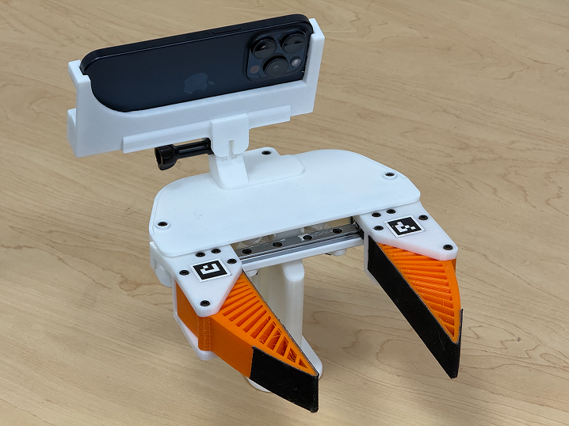

Setup the AR tags as follows, making sure to match the tag orientation:

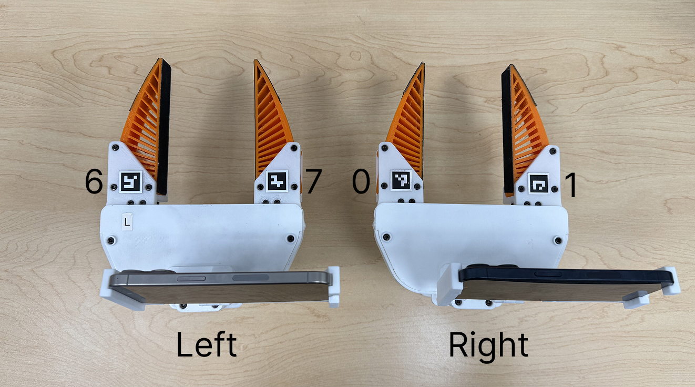

## Using contact microphone
If you would like to record the tactile data with one of the fingertips, you can use the updated finger design and contact microphone from [ManiWAV](https://maniwav.github.io/). The contact microphone from ManiWAV goes from contact mic to 6.35mm female connector. Thus you will need to get a 6.35mm male to USB C ***recording*** adapter. Note that many cables are designed to output USB C audio to a 6.35mm speaker, which will not work for our use case. We instead need a cable for recording audio from the 6.35mm connection to the USB connection, such as [this one](https://www.amazon.com/Guitar-Recording-Electronic-Microphone-Compatible/dp/B0D6YYJ8RT/). A shorter cable (1ft) is more ideal to keep the system tidy, but these seem hard to find, but you can easily wrap excess cable from a 3.3ft cable length around the stem of the iPhone mount. We have found that using (USB C to 3.5mm female adapter -> 3.5mm male to 6.35mm male adapter -> 6.35mm female to contact mic) does ***not*** seem to work properly.

Once you have the contact microphone connected you should see the microphone icon update in the data collection interface to indicate that the contact microphone is properly detected.

The audio will be stored in the mp4 video files. When you view the recorded demonstrations from within the iPhUMI app you will need to unplug the contact mic in order to have the iPhone output the recorded audio to the speakers. When the contact mic is plugged in, the task narration feature is disabled as the iPhone will only be able to read audio input from the contact microphone.

Contact mic information is currently only stored in the MP4 files and is not yet put into the replay buffer.

In the [ManiWAV README](https://github.com/real-stanford/maniwav), you can find the extra compliant TPU85 3D printing material (green fingers used in ManiWAV), the CAD model for the finger with the mic cutout, and the contact microphone.

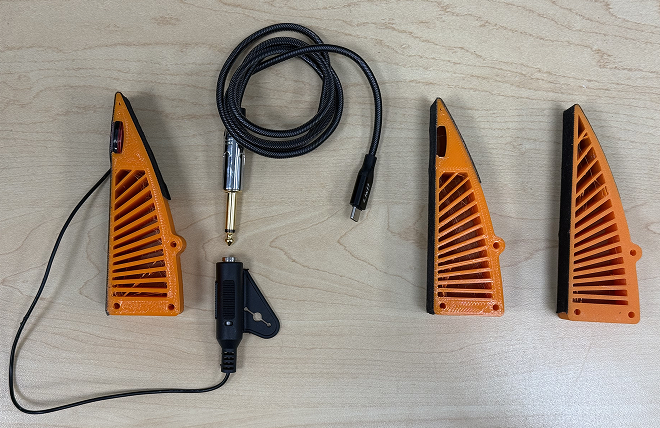

*From left to right: finger with contact mic and 6.35mm to USB C adapter, finger with no contact mic inserted, finger with no slot for contact mic. These are printed with the standard UMI TPU 95A, not extra compliant TPU 85A from ManiWAV.*

> When first plugging in the contact mic you will be presented with a popup. Make sure to select `Headphones` as the type.

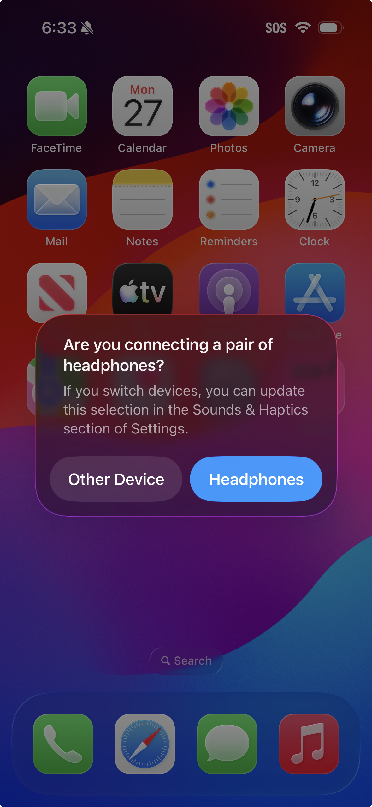

If this setting doesn't show up then go to: Settings -> Sounds & Haptics -> Headphone Safety -> USB Audio Accessories -> Forget All USB Audio Accessories. Then plug in the contact mic via USB C and the popup should appear. The toggle for "Connected To Headphones" should be on.

# Install the iPhone app
## Installation steps
- Download Xcode and update to the latest version (MacOS required; you will might need update to MacOS 26 for the app to build correctly). You will be prompted to install the latest iOS SDK when first launching Xcode, which you should do.
- Update your iPhone to the latest iOS version (iOS 26)
- Install CocoaPods for Swift dependency management. You can install it [with Homebrew](https://formulae.brew.sh/formula/cocoapods) (recommended) or [with gem](https://guides.cocoapods.org/using/getting-started.html).
- In the root of the `ios_app` folder run `pod install`
- Open the `ios_app/iPhUMI.xcworkspace` file which will launch Xcode
- In Xcode sign the app by logging in with a free Apple developer account (`Team` shown in the screenshot below). Change the bundle identifier to something unique. If you change the bundle identifier it will result in a different instance of the app installed on your phone, so reuse the same bundle identifier you chose to prevent multiple versions of the app showing up on your device. If you get an error, try another bundle identifier. Make sure you have the `All` mode selected (you can see `All` is selected in the screenshot below) when you update the signing settings.

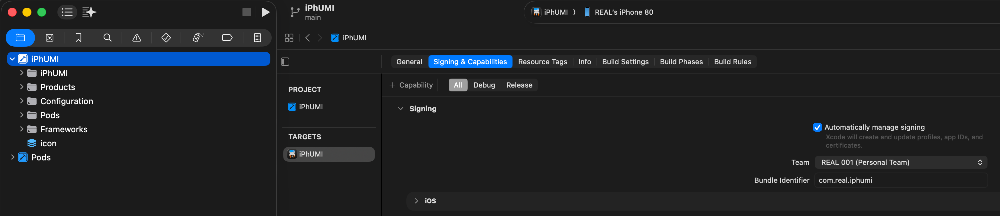

- Connect your phone to the Mac computer with a USB cable. Your phone will then prompt you to trust the computer.
- Enable Developer Mode on your iPhone following [these instructions](https://developer.apple.com/documentation/xcode/enabling-developer-mode-on-a-device) on your device. The setting for enabling developer mode may only appear if your phone is actively plugged into a Mac computer. This process usually requires a phone reboot to complete. You can check if developer mode is enabled by opening the Settings app and scolling to the bottom: if there is a section for developer mode then it's enabled.
- Make sure your iPhone is connected to the internet in order for the app installation to properly sign.
- Install app on your device through Xcode by selecting your device on the top bar and then pressing the run button. The first time you use a developer account on a device you will need to verify the developer in the Settings app on the iPhone: go to Settings -> General -> VPN & Device Management -> Trust the developer account. Now you will be able to open the installed app.
- Accept all the permissions requested by the app on it's first launch to ensure the app will work properly.
- If you have a free Apple Developer account the app will be functional for a week before you will have to re-sign it (just reinstall on the phone and it will work again). If the app expires your data will still be there when you reinstall (assuming you use the same bundle identifier). If you have a paid account it will last a year before you need to reinstall.

## Troubleshooting
- Make sure you are on the latest MacOS and iOS versions and you have the latest iOS SDK installed on your computer though Xcode. Also try connecting your phone to the computer and then selecting your device in Xcode as the run destination; this can help ensure it's building for the correct target.
- Make sure to enable Developer Mode on your phone. If you can't find the setting to enable Developer Mode try connecting your phone to the Mac with Xcode installed and sometimes that makes the option appear. Follow these [developer mode setup instructions](https://developer.apple.com/documentation/xcode/enabling-developer-mode-on-a-device).
- `AnchorEntity error` during build: try the above steps to make sure you are building to the right target device and have the latest MacOS/iOS versions.
- `Communication with Apple failed: Your development team has reached the maximum number of registered iPhone devices`: use a different Apple developer account or use one of the devices you have already registered
- `Failed to register bundle identifier`: try a different bundle identifier
- Make sure to have `All` mode selected in the `Signing & Capabilities` section. Do not have `Release` selected because we are doing the installation in `Debug` mode so changing the `Release` settings will have no impact!

# Collect demonstration data

## Supported data collection modalities
Using the data collection mode you can collect:
- 60Hz 6DoF pose (real-time) with a shared world coordinate frame between up to 3 iPhones (theoretically more could be supported up to ARKit limit)
- Main camera RGB at 1920x1440@60Hz 
- Ultrawide camera at 640x480@10Hz (not present on prior iPhone-based UMI designs)
- LiDAR depth at 256x192@60Hz
- Contact microphone at 48kHz connected over USB C
- Language task narration (via on-device microphone)
- Other data modalities (you can extend the iPhUMI app to receive data over USB, Bluetooth, or Ethernet streams to the iPhone)

## Prepare for data collection
Open the "Collect Demonstration" mode on the app. ARKit will initialize the world coordinate frame at the initial location of the iPhone. If you want to see this coordinate frame you can enable the viewer in the settings, but typically the viewer should be disabled for performance. The actual location of the world coordinate frame doesn't matter as UMI uses relative actions, but if the XYZ coordinates shown in the app become very large or is moving around unstably, you can press the "Restart" button.

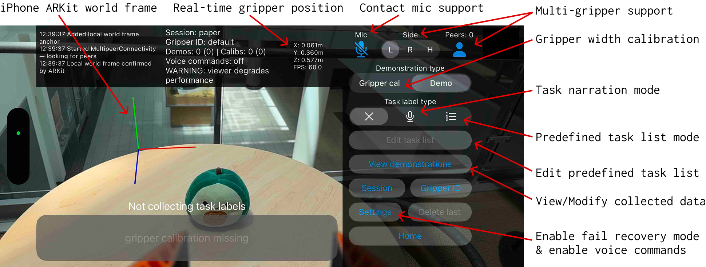

Press the "Disable Viewer" button to turn the viewer off, as the phone will often overheat when the viewer is enabled. You should almost always have the viewer disabled.

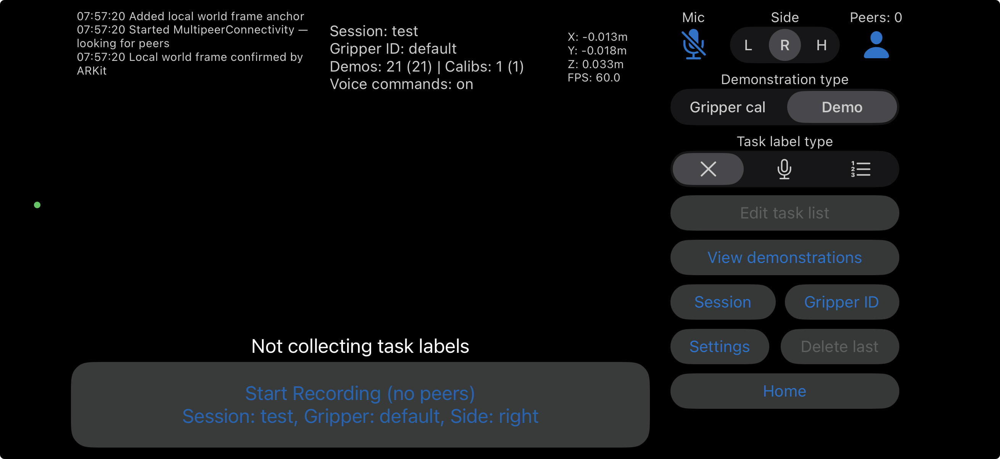

### Side
If you are just using one iPhUMI, you should set the Side selector at the top of the interface to `R` for right (or `L` if you hold the iPhUMI in your left hand).

### Session ID
First set the Session ID. You must set this before you can collect your gripper calibration and demonstrations. The session name defines an identifier that groups demonstrations together, making them easier to batch process later on. Often it's nice to include the date in the session, such as  `041626-outdoor-cup`. Then you can specify this tag later on during Python post processing to process demos just from this session. You can use `test-session` for now.

### Gripper ID
If you are using the default iPhUMI gripper design, you should leave the Gripper ID as `default` (tap "Set Gripper ID" → "Use default"). Please see [Using a different gripper design](#using-a-different-gripper-design) if you are using a modified gripper.

## Gripper calibration
Select the "Gripper cal" demonstration type and perform the gripper calibration by starting a recording and then opening and closing the gripper five times. Make sure to slowly fully open and fully close the gripper each time to ensure the best calibration. This is done to identify the minimum and maximux width of the gripper as well as measure the relative movement between the left and right fingers using the AR tags on the fingers. You will need to perform gripper calibration each time you pick a new session name or use a different gripper ID.

Press the `View Demonstrations` button and you can click into your calibration demonstration. For gripper calibrations we only record the ultrawide camera RGB to track the AR tags and do not record other modalities as they aren't needed.

## Demo collection
In the main data collection interface, switch from "Gripper cal" mode to "Demo" mode (this automaticallly happens after gripper calibration is collected). Then select a "Task label type" either: no label (X icon), language narration (mic icon) or a predefined task list (list icon).

### No task label

If you are collecting data for a single task policy you can just select no label.

### Task narration

For language narration you can narrate the task labels. Once you start recording, say a task label like "pick up the cup." After you finish saying "cup" the app will automatically start tagging this portion of the demonstration with that task label either until you say "done" or "stop", or until you start narrating the next task label. If you then said "put the cup in the sink," then the previous task would be marked as done right when you start saying "put". While you are actively speaking no task label is assigned.

You can say `done` to explicitly mark the current task as complete and pause labeling until you begin narrating the next task. This is useful when you want a clear boundary between tasks without immediately starting the next label. Saying `stop` ends the recording entirely.

### Predefined task list

Oftentimes you want to repeat a single task or a sequence of tasks many times in a row as you collect a large set of demonstrations. You can specify this predefined task list by selecting the list icon and then clicking on the "Edit task list" button where you can manually type in a sequence of task names. When you start recording it will step through these task names one by one and label the portions of the demonstration accordingly. If you expect a pause between two consecutive tasks you can add a confirmation between the two so that you have a empty section where no task label is applied.

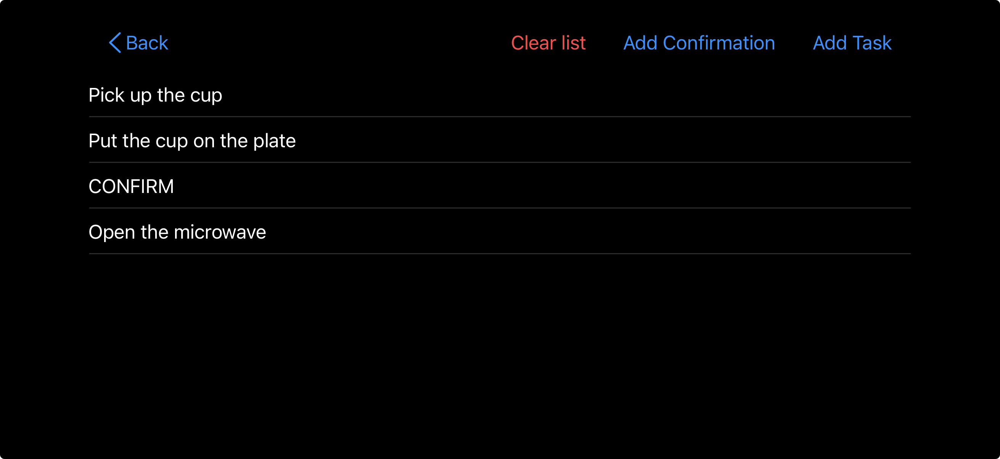

### Voice commands

The app supports hands-free voice commands via on-device speech recognition. This allows you to start and stop recordings without touching the phone. Voice commands are enabled by default and can be toggled in the Settings menu under **Enable Voice Commands**. The settings entry lists the valid words.

| Command | Word | Behavior |
|---------|------|----------|
| Start | `start` | Begins a new recording session (or marks the start of the next task in Predefined mode) |
| Stop | `stop` | Stops the current recording (or marks the current task as complete in Predefined mode) |
| Delete | `delete` | Deletes the most recently recorded demonstration (only works when not recording) |
| Done | `done` | Narration mode only — marks the current task label as complete without stopping the recording |

Notes:
- voice commands are automatically disabled while a contact microphone is plugged in, since the iPhone routes all audio input through the contact mic.
- If you are using multiple devices, make sure this feature is only enabled on one of the phones.

## Viewing and managing demonstrations
You can view and manage your demos with the "View demonstrations" button. In this interface you can delete individual demonstrations by swiping left on a list entry. The app will prevent you from deleting a gripper calibration if there are still existing demonstrations that are referencing these gripper calibrations.

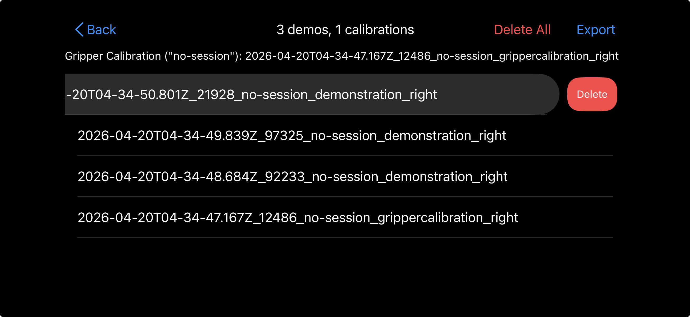

You can also view the data collected in each demonstrations as well as the task labels assigned to the demonstration. If you click on a demonstration you collected (not a gripper calibration), you will see buttons to view the main camera RGB, ultrawide RGB, and depth (if your device has a LiDAR).

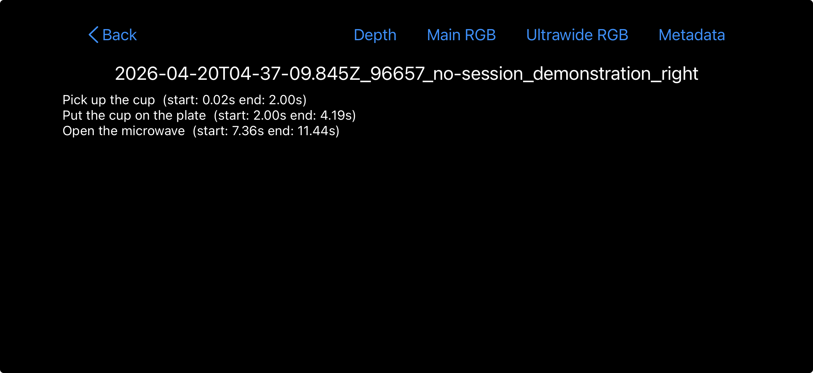

You can also export the demonstrations to an SD card using a USB C adapter by pressing the `Export` button in the view demonstrations interface. If you don't have a USB C adapter, you can always export the files locally to the phone and then transfer manually (for example using AirDrop). We found AirDrop works well for a few demonstrations, but not for a lot of demonstrations at once.

## Error recovery demonstrations

If you want to collect partial demonstrations of a task, such demonstrations showing recovery from error states, you should make sure to label those demonstrations as partial demonstrations. You can do so by enabling "Error Correction Mode" in the settings menu of the data collection interface. This will set a flag in the demonstration data JSON. This labeling is imporant for policies that treat full demonstrations of a task differently than partial demonstrations, such as <a href="https://behavior-prompting.github.io/">Behavior Prompting Policy.</a>

## Multi-iPhone recording (bimanual/head-mounted)

### Bimanual iPhUMI
The iPhUMI app supports connecting multiple iPhUMI grippers together into a shared data collection setup. Once the grippers have joined a shared session they will agree on a shared world coordinate frame between them. This means that we will be able to correctly compute an inter-gripper transform. The iPhones will jointly collaborate on building the world map using multi-view tracking, meaning that tracking performance will improve with more devices.

Press record on one iPhone and recording will automatically start/stop on the other device. Make sure to set the `Side` toggle in the data collection interface to indicate which hand (left/right) each iPhUMI is in before you start recording. If you delete a demonstration on one iPhone, it will ***not*** automatically delete on the other iPhone, but this is fine since the post processing code will filter out demonstrations where one side has been deleted. You will need to export the data individually per device and the Python post processing code will align them.

> If you are using the voice commands to start/stop the recording, make sure this feature is only enabled on one of the phones in the connection session!

### Bimanual iPhUMI + head mounted iPhone
You can use a head mounted iPhone that is also able to join the multi iPhone session for a total of three iPhone devices. Select `H` for head as the side for the head mounted iPhone. See [HoMMI](https://hommi-robot.github.io/) for more details.

### Advice for pairing the phones
- Make each phone is actively connected to the internet, as it seems this is required to makes the pairing work. The phones don't need to be on the same WiFi network (for example we have found pairing to work when one device is on WiFi and another is on cellular). If you collect data outside, I recommend using a personal hotspot from a separate phone.
- If the phones aren't connecting reliably, make sure that they have a strong internet connection.
- Hold the phones side by side and jointly move them around to view the scene from multiple angles.
- Find a scene with high visual features. Both phones will pair together once they have identified shared world features between them.
- You only need to scan the scene from one side (you don't have to move the iPhones around by an extreme amount). You can do the entire pairing standing still and just moving your arms around slightly with both phones pointing in the same direction.
- If you are using three devices you can join them pairwise: move around two of the phones together to get them to pair, then take one of the paired phones and the third phone and move them around together.

### Why are the peer distances not equal on the connected phones?
When you connect multiple devices each will report the distance to the peer devices. The distances are not equal between two devices because when ARKit streams the poses of the peers to each other device, it converts the pose of the peer from the main camera optical frame to a coordinate frame at the center of the device. Then we compute the distance from the center frame of the other device to the optical frame of the current device. You can see this frame for yourself by enabling the viewer in the data collection interface and then connecting two phones. If you point one phone at the other, the center pose of the peer phone will be overlaid as a coordinate frame on top of the peer device.

You do not need to worry about these peer distances not matching since each phone records its own main camera frame poses (with respect to the same world frame) that are later jointly processed.

## Troubleshooting
### General
- The app often will prevent you from collecting data if one of the conditions is not met. For example, the device might be too hot and drops to 30 FPS or you may have not completed the gripper calibration yet. The app may also abort a demonstration in the middle of the recording if the FPS substantially drops. You will also not be allowed to record a demonstration if multiple devices are found, but not fully paired yet. These are all safeguards to ensure that the data you collect with the app is always valid.
- We do observe that the phone doesn't always maintain a perfect 60 FPS. This may lead to having some dropped frames in your recorded data. This is something to be aware of, but likely won't have any meaningful impact on your policy training. If the FPS drops too much, the app will abort the demonstration.
- If you are having problems with recordings not saving, make sure that your device is not out of storage. The app will warn you if you are running out of storage.
- If you get an ARKit session failed or sensor failed issue, make sure that you do not have any Bluetooth headphones (such as AirPods) actively connected to the device. The app will try to connect to available microphone sources, which can cause issues when unexpected devices connect.

### SLAM tracking
We use ARKit to track 6DOF pose of the phone. It's a well tuned system that works quite well in practice by leveraging multiple sensors on the iPhone to do impressive/robust tracking, but it's not magic. Just like any other SLAM system it has challenges tracking in environments with few features, poor lighting, and during very rapid movement.

To assist with this, we have checks that will abort the recording if the phone detects a big pose jump. We also have the `align_validate` stage in the Python post processing code that you can tune to add additional pose trajectory checks.

Advice to ensure the best tracking if you have issues with the recorded trajectory being unstable:
- If you are recording against blank walls you should add 2D features to your scene (print out a couple images to tape on the walls)
- [optional] Add 3D features to your scene (put random objects in your environment)
- Start the data collection interface without the object you plan to interact with present. Move the iphone around from a couple views to build the world map (there is no feedback on this it just happens in the background). If you are connecting multiple iPhones then make sure they have established the full connected with each other first. Then add your desired manipulation object into the scene. This is because we don't want to build a world map with an object that will move around. The iPhone is pretty robust to this, but this is just for extra careful precaution.
- Make sure there are a good amount of visual features within a reasonable distance (visual features very far away often aren't super useful)
- Avoid scenes with only flat features and blank walls. If you have blank walls put printed images on the walls and it will work fine.

### Multi-iPhone
- Make sure your devices are connected to the internet with Bluetooth on if you are using multi-device pairing.
- If you see `received unknown data from peer` make sure both phones are on the same iOS version and the same iPhUMI app version
- If you are using the voice commands to start/stop the recording, make sure this feature is only enabled on one of the phones in the connection session

# Build an iPhUMI dataset
Once you have demonstrations recorded, you can run the code in `python_package/iphumi/demonstration_processing` to process the demonstrations and convert them into a zarr dataset.

## Environment setup

First, setup the `iphumi` conda environment.
```bash
cd python_package
mamba env create -f environment.yml
```

## Example data
We provide example data that let's you test the processing pipeline for single, bimanual, and bimanual with head mount.

To download this raw sample data ready for processing:
```bash
# dataset location: https://huggingface.co/datasets/austinpatel/iphumi_example_data
cd iPhUMI # go into the root of this repo
hf download austinpatel/iphumi_example_data --repo-type=dataset --local-dir ./iphumi_example_data
```

The steps below show you how to process these raw files into zarr datasets, but if you just want want the final zarr datasets directly:
```bash
# dataset location: https://huggingface.co/datasets/austinpatel/iphumi_example_zarr_datasets
cd iPhUMI # go into the root of this repo
hf download austinpatel/iphumi_example_zarr_datasets --repo-type=dataset --local-dir ./iphumi_example_zarr_datasets
```


Then copy in the sample data into [tmp_demonstrations](../python_package/iphumi/demonstration_processing/tmp_demonstrations):
```bash
cd python_package/iphumi/demonstration_processing

python link_shared_iphumi_data.py shared_path=../../../iphumi_example_data/test-data-042926-raw.zip
```

Then process the sample data into zarr datasets:
```bash
cd python_package/iphumi/demonstration_processing

python process_demos_iphone.py filters.session_name=test-data-042926 skip_stages="[group]"

# then open up the datset viewer (the visualizations will show on this viewer once they have finished **generating**)

python demo_viewer_server.py tmp_demonstrations 
```

Then create zarr datasets:
```bash
# once the process_demos_iphone.py command starts the visualization stage, you are safe to run the following commands. Run all of them or run just the one for the type of data you are interested in:

# single gripper
python create_session_iphone.py input_session_filters="[test-data-042926]" output_session_name=test-data-042926-single sides=single
python build_umi_dataset_iphone.py session_dir=tmp_sessions/test-data-042926-single
python vis_replay_buffer.py tmp_sessions/test-data-042926-single/replay_buffer_test-data-042926-single.zarr.zip --vis-all

# bimanual
python create_session_iphone.py input_session_filters="[test-data-042926]" output_session_name=test-data-042926-bimanual sides=bimanual
python build_umi_dataset_iphone.py session_dir=tmp_sessions/test-data-042926-bimanual
python vis_replay_buffer.py tmp_sessions/test-data-042926-bimanual/replay_buffer_test-data-042926-bimanual.zarr.zip --vis-all

# bimanual + head mount
python create_session_iphone.py input_session_filters="[test-data-042926]" output_session_name=test-data-042926-bimanual-and-head sides=bimanual_and_head
python build_umi_dataset_iphone.py session_dir=tmp_sessions/test-data-042926-bimanual-and-head
python vis_replay_buffer.py tmp_sessions/test-data-042926-bimanual-and-head/replay_buffer_test-data-042926-bimanual-and-head.zarr.zip --vis-all

# right + head mount
python create_session_iphone.py input_session_filters="[test-data-042926]" output_session_name=test-data-042926-right-and-head sides=right_and_head
python build_umi_dataset_iphone.py session_dir=tmp_sessions/test-data-042926-right-and-head
python vis_replay_buffer.py tmp_sessions/test-data-042926-right-and-head/replay_buffer_test-data-042926-right-and-head.zarr.zip --vis-all
```

## Process demos

If you have collected data of your own, you should have your demonstration data exported from the iPhone to an SD card or transferred to your computer. The processing pipeline will copy the demonstration data from their source (SD card) onto your computer in `python_package/iphumi/demonstration_processing/tmp_demonstrations`, group demonstrations together for multi-iPhone data, run the AR tag detection to determine gripper width, and visualize the collected data. Run this script (arguments found [here](../python_package/iphumi/demonstration_processing/config/process_demos_iphone.yaml)):
```bash
python process_demos_iphone.py filters.session_name=test-session group.iphone_dir=/path/to/sd_card/iPhUMI_export
```

> On MacOS this will open an Open3D window as part of the trajectory visualization. On Ubuntu this rendering will be done in an offscreen renderer, so no window will open. If you can find how to do the rendering offscreen on MacOS that would be a useful contribution.

Check the visualizations within the demonstration folders to sanity check that everything looks good.

Let's say you wanted to rerun the visualize stage just one one of the demonstrations. You could do something like this:
```bash
python process_demos_iphone.py filters.session_name=test-data-042926 stages="[visualize]" filters.demonstration_names="[2026-04-30T00-41-19.500Z_34925_test-data-042926_demonstration]" overwrite=true
```

### Task-specific config overrides

For task-specific processing settings (e.g. custom `align_validate` demonstration filtering thresholds), create a YAML file in [`config/process_custom/`](../python_package/iphumi/demonstration_processing/config/process_custom/) — see [`example.yaml`](../python_package/iphumi/demonstration_processing/config/process_custom/example.yaml) for the format. Only include the keys you want to override; everything else inherits from `process_demos_iphone.yaml`. Apply it with the `process_custom` argument:

```bash
python process_demos_iphone.py process_custom=my_task filters.session_name=... 
```

## Create session

Now that we have processed the demonstrations, you need to figure out which data you would like to put into your dataset. We call this grouping of data a Dataset Session, which can consist of one or more Session IDs you specified when collecting data. A Dataset Session must consist of only one combination of sides present (for example you can't mix bimanual data with with single gripper data in a session).

Run this script (arguments found [here](../python_package/iphumi/demonstration_processing/config/create_session_iphone.yaml)):
```bash
# just one Session ID into your `Dataset Session`
python create_session_iphone.py input_session_filters="[test-session]" output_session_name=test-session

# or if you have multiple session IDs you want in your `Dataset Session`
python create_session_iphone.py input_session_filters="[A,B,C]" output_session_name=my_three_sessions
```

This will create a session in `python_package/iphumi/demonstration_processing/tmp_sessions` that symlinks the selected demonstrations back to their source in `tmp_demonstrations`.

## Create dataset

Now we want to take the demonstrations we have aggregated into a Dataset Session and generate a `.zarr.zip` replay buffer. Run this script (args [here](../python_package/iphumi/demonstration_processing/config/build_umi_dataset_iphone.yaml)):

```bash
python build_umi_dataset_iphone.py session_dir=tmp_sessions/test-data-042926-bimanual-and-head # replay_buffer.include_depth=true if you would like depth included
```

This will create a `.zarr.zip` dataset within your sessions folder. The dataset has the following key structure (this example consists of 4 tasks across 3 demonstrations):
```
/
 ├── data
 │   ├── camera_head_depth (2286, 192, 256, 1) float16
 │   ├── camera_head_main_rgb (2286, 224, 224, 3) uint8
 │   ├── camera_head_ultrawide_rgb (381, 224, 224, 3) uint8
 │   ├── camera_left_depth (2286, 192, 256, 1) float16
 │   ├── camera_left_main_rgb (2286, 224, 224, 3) uint8
 │   ├── camera_left_ultrawide_rgb (381, 224, 224, 3) uint8
 │   ├── camera_right_depth (2286, 192, 256, 1) float16
 │   ├── camera_right_main_rgb (2286, 224, 224, 3) uint8
 │   ├── camera_right_ultrawide_rgb (382, 224, 224, 3) uint8
 │   ├── gripper_head_eef_pos (2286, 3) float32
 │   ├── gripper_head_eef_rot_axis_angle (2286, 3) float32
 │   ├── gripper_left_eef_pos (2286, 3) float32
 │   ├── gripper_left_eef_rot_axis_angle (2286, 3) float32
 │   ├── gripper_left_gripper_width (2286, 1) float32
 │   ├── gripper_right_eef_pos (2286, 3) float32
 │   ├── gripper_right_eef_rot_axis_angle (2286, 3) float32
 │   └── gripper_right_gripper_width (2286, 1) float32
 ├── labels
 └── meta
     ├── downsample_index_camera_head_ultrawide_rgb (381,) int64
     ├── downsample_index_camera_left_ultrawide_rgb (381,) int64
     ├── downsample_index_camera_right_ultrawide_rgb (382,) int64
     ├── episode_ends (3,) int64
     ├── episode_ends_camera_head_ultrawide_rgb (3,) int64
     ├── episode_ends_camera_left_ultrawide_rgb (3,) int64
     ├── episode_ends_camera_right_ultrawide_rgb (3,) int64
     ├── episode_names (3,) object
     ├── task_data_ends (4,) int64
     ├── task_labels_ends (4,) int64
     ├── task_lengths (4,) int64
     ├── task_names (4,) object
     ├── upsample_index_camera_head_ultrawide_rgb (2286,) int64
     ├── upsample_index_camera_left_ultrawide_rgb (2286,) int64
     └── upsample_index_camera_right_ultrawide_rgb (2286,) int64
```

Note that because the ultrawide input is only at 10Hz (compared to 60Hz for the rest of the data), we have special keys to help align the data:
- `data/camera_right_ultrawide_rgb` has a smaller number of frames than other entries in data due to 10Hz recording
- `meta/downsample_index_camera_right_ultrawide_rgb` maps from an ultrawide frame index to the index in the standard 60Hz data.
- `meta/upsample_index_camera_right_ultrawide_rgb` maps from a normal 60Hz data index to the corresponding ultrawide image that is most recent in time (looking backward in time).
- `meta/episode_ends_camera_right_ultrawide_rgb` this is only for episode sampling (discussed below). Given an episode index, it will give you the corresponding episode final frame index into `data/camera_right_ultrawide_rgb`. Given that we have the downsample and upsample entries above, it's likely you won't need to use this key in your sampler logic.

Some additional notes:
- Each episode can contain multiple tasks.
- For indexing into entries in `data`. Use `episode_ends` to sample at the episode level (for single task training) or `task_data_ends` to sample at the task level  (for multi-task training). For the ultrawide RGB that has a lower frequency you should convert the indices you get from `episode_ends` or `task_data_ends` to indices for ultrawide frames using `upsample_index_camera_right_ultrawide_rgb` before indexing into `camera_right_ultrawide_rgb`.
- `robot0_demo_start_pose` are the same across all indices in an episode and contain the first pose in that episode (pose is `cat(gripper_right_eef_pos, gripper_right_eef_rot_axis_angle)`)
- Tasks theoretically can overlap with one another. In other words a single frame in the dataset may fall under multiple tasks. However, with the default iPhUMI task labeling approaches this will not be the case (there will only be at most one task at a time).
- By default there are no labels output. Labels are useful if you want to add some additional data that is associated with each ***task*** (rather than at the episode level). For example, you could use this to store a number tracking the task progress for each frame in each task. To index into these labels, `tasks_labels_ends` and `task_lengths` would help you select out the correct portion from keys in labels given a task index.
- The gripper poses are in the TCP coordinate frame convention (see [Coordinate frame conventions](#coordinate-frame-conventions)).

- The head pose follows the orientation of the TCP transform for the normal iPhUMI gripper, but remains centered at the optical center of the main iPhone camera (no position offset applied).

## Print/Visualize dataset
You can print out the dataset attributes and the zarr chunking with:
```bash
python print_replay_buffer.py <path to zarr.zip>
```

You can visualize the pose trajectory aligned with the RGB/depth in the dataset with:
```bash
python vis_replay_buffer.py <path to zarr.zip>
```

This will also show how we add black bars to the top and bottom of the RGB to fit in the 224x224px shape.

## Trajectory viewer
You can interactively view recorded trajectories in an Open3D window using `interactive_trajectory_viewer.py`. Trajectories are shown in TCP space by default. Colors: left=red, right=blue, head=green.

```bash
cd python_package/iphumi/demonstration_processing

python interactive_trajectory_viewer.py path/to/right.json
python interactive_trajectory_viewer.py path/to/right_aligned.csv
python interactive_trajectory_viewer.py path/to/demonstration_dir # show trajectories from left/right/head together
```

## Share your iPhUMI data
If you want to share your iPhUMI data with others we have scripts to export data from tmp_demonstrations and then copy that exported data back into tmp_demonstrations on another computer.

```bash
cd python_package/iphumi/demonstration_processing

python share_iphumi_data.py output_name=test-session filters.session_name=test-session # only shares raw files that iPhUMI app saves
python share_iphumi_data.py output_name=test-session filters.session_name=test-session raw_only=false # copies all files in each demonstration directory including outputs from the processing scripts

# to share all demos from a Dataset Session (e.g. created with create_session_iphone.py), point demonstrations_dir at the session folder:
python share_iphumi_data.py output_name=my-session demonstrations_dir=tmp_sessions/my-session
```

When you want to copy that data back into tmp_demonstrations:
```bash
cd python_package/iphumi/demonstration_processing

# you can specify either zipped or non-zipped output
python link_shared_iphumi_data.py shared_path=tmp_sharing/test-session-raw
python link_shared_iphumi_data.py shared_path=tmp_sharing/test-session-raw.zip

# then if you run process_demos_iphone.py on this data, you can include skip_stages="[group]" since this data has already gone through the group stage before being shared
```

Consider sharing your data with the community on the [UMI Data Initiative](https://umi-data.github.io/)!

## Misc scripts
- [rename_session_in_exported_data.py](../python_package/iphumi/demonstration_processing/scripts/rename_session_in_exported_data.py) - if you want to change the session name in data you have already exported from an iPhone you can use this script to do so


# Train a policy using iPhUMI data
The code to train diffusion policy from iPhUMI data is located in the Behavior Prompting Policy repository. TODO. Please follow the instructions there.

Since we have the ultrawide RGB at 10Hz and the rest of the data at 60Hz, you will need special logic in your dataset sampler to properly handle this. See the [Create dataset](#create-dataset) section for details on how to map between the 10Hz and 60Hz data. Our provided training code already handles this.

# Deploy iPhone on robot

To deploy policies trained using iPhUMI, we add support for using the iPhone as the deployment camera on the robot. Note that unlike the original UMI with GoPro, we do not mask out the AR tags on the finger in the replay buffer. Therefore you can put the AR tags on the deployment robot (as pictured below) to minimize visual disparity, but in practice it doesn't seem to matter if you put the tags on the robot or not (or if you put on tags with the wrong identifier).

You can find the iPhUMI deploymet code and instructions in the Behavior Prompting Policy repo. TODO. Currently we have validated iPhUMI deployment on bimanual ARX and on single arm UR5.

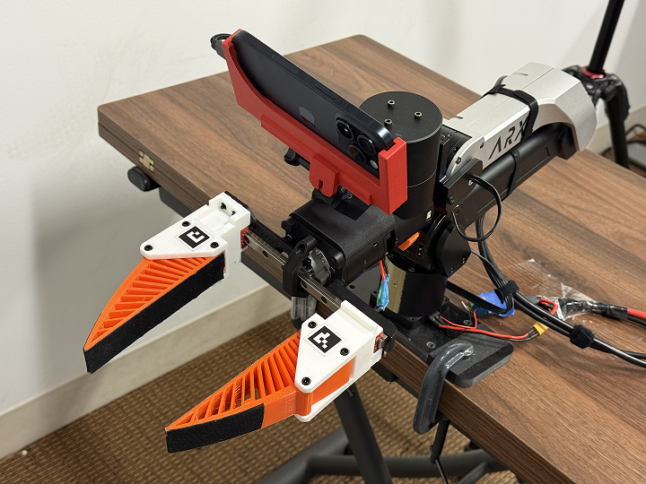

## Supported streaming modalities
Using the deployment mode in the app, you can stream the follow camera stream over either USB or Ethernet:
- Main and ultrawide RGB camera at either 320x240 or 960x720 at 30Hz or 60Hz (any combination works)
- LiDAR depth at 320x240@30Hz (due to iOS restrictions we can't get this at 60Hz with `AVCaptureMultiCamSession`; if you need 60Hz depth streaming you can update the app to use `ARKit` in the deployment interface instead)

We currently do not support streaming iPhone pose. Though this is definitely possible (see [Record3D](https://record3d.app/)) by running an `ARKit` session in the deployment interface and would be a welcome contribution that could exist alongside the current implementation.

Here is what the interface looks like:

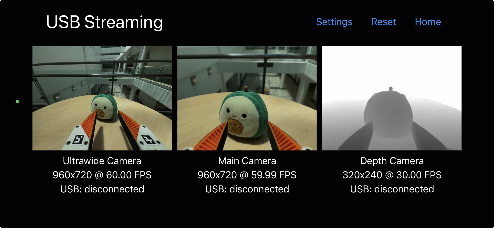

I recommend using the USB streaming mode, as it's easier to setup than the Ethernet mode, and I have found USB streamign to better supoprt the higher resolution mode.

## USB streaming setup
USB streaming has been validated to work with MacOS and Ubuntu.

1. Connect the iPhone to your computer with a USB cable (opt for the highest bandwidth cable/port you can use). USB 3.0 connection using USB C to C or USB C to A work well.
2. Run the associated Python code `test_iphone_usb_streaming.py` in `python_package/iphumi/deployment` and you should see the stream appear. The stream should have fairly low latency and not lag, even with the higher RGB resolution/frame rates.

```bash
cd python_package/iphumi/deployment
python test_iphone_usb_streaming.py

# to evaluate latency, point camera at rolling QR code (should be around ~100ms with low res streaming):
python test_iphone_usb_streaming.py --eval_latency

# to stream multiple devices (try the lower resolution setting in the app if you see lag in the stream)
python test_iphone_usb_streaming.py --devices 2

# to stream by device id
python test_iphone_usb_streaming.py --get-ids # to get device ids
python test_iphone_usb_streaming.py --ids ABC XYZ
```

## Ethernet streaming setup
I recommend using USB streaming as it seems to work better than ethernet at the higher resolution mode, but you can follow these steps to try ethernet streaming.

I recommend using a USB C to ethernet cable (at least 2.5 Gbps bandwidth for best performance) that also includes a charging port, such as [this one](https://www.amazon.com/dp/B0FC61NLVD), so the iPhone maintains charge during deployment.

1. Setup the cables as follows:
iPhone (Client) <-> USB C to ethernet adapter (2.5 Gbps or above) <-> Ethernet cable (Cat6 or above) <-> Computer (Host) using a USB-Ethernet adapter (2.5 Gbps or above)

1. Set the "Ethernet Host IP" on the previous screen to the desired IP that your iPhone will send the stream to. The default is `192.168.123.18`.

2. Once you have the USB C ethernet adapter connected to the iPhone, open up the Settings app and you will see an "Ethernet" section appear right between "Wi-Fi" and "Bluetooth" sections. Go into this section, select your Ethernet adapter, and set "Configure IP" to Manual, set "IP Address" to match the Host IP except with a different last value (for example by default I would use `192.168.123.17`), and finally set "Subnet Mask" to `255.255.255.0`. Back in the iPhUMI app, you should now see "Ethernet iPhone IP" on update to show the IP address you have just set.

3. On the host computer configure your ethernet adapter to use manual IPv4 with an IP address matching what you specified as the "Ethernet Host IP" in the iPhUMI deployment settings (by default `192.168.123.18`) with a subnet mask of `255.255.255.0`.

4. Run the associated Python code `test_iphone_ethernet_streaming.py` in `python_package/iphumi/deployment` and provide the value you used for "Ethernet Host IP" and then you should see the stream appear. The stream should have fairly low latency and not lag. Ethernet streaming seems to work much better when using the lower camera resolution mode.
```bash
cd python_package/iphumi/deployment
# ethernet adapter (192.168.123.18, 255.255.255.0) <-> iPhone (192.168.123.17, 255.255.255.0) with iPhUMI app configured to send to Host: 192.168.123.18
python test_iphone_ethernet_streaming.py --hosts 192.168.123.18

# to evaluate latency, point camera at rolling QR code (should be around ~100ms with low res streaming):
python test_iphone_ethernet_streaming.py --hosts 192.168.123.18 --eval_latency

# you can setup multiple ethernet adapters to your computer to stream from multiple devices at once:
# computer <-> ethernet adapter 1 (192.168.123.18, 255.255.255.0) <-> iPhone 1 (192.168.123.17, 255.255.255.0) with iPhUMI app configured to send to Host: 192.168.123.18
# computer <-> ethernet adapter 2 (192.168.123.19, 255.255.255.0) <-> iPhone 2 (192.168.123.17, 255.255.255.0) with iPhUMI app configured to send to Host: 192.168.123.19
python test_iphone_ethernet_streaming.py --hosts 192.168.123.18 192.168.123.19
```

## Robot specific hardware instructions

### ARX
If you are using an ARX arm, you can find the UMI mount [here](https://cad.onshape.com/documents/5271ff5a948a7f51a716e01a/w/e3126df2755b00dcbc5c3e44/e/a1d06c981a25bef960902412). This mount already has the mirrors removed (the original UMI design has mirrors).

### UR5
If you are using WSG50 gripper on UR5, you can find the UMI mount [here](https://cad.onshape.com/documents/fea49753b2350f8700f47815). You will need to modify the mount to remove them mirrors.

### Franka
If you are using WSG50 gripper on Franka, you can find the UMI mount [here](https://cad.onshape.com/documents/10e70b8dbf6f9fe17c716739). You will need to modify the mount to remove them mirrors.


# Supporting additional iPhone models
It's easy to support additional iPhone models (ultrawide camera required, LiDAR is optional):

1. Modify the provided iPhone mount ([at this OnShape link](https://cad.onshape.com/documents/f77480642f2120b57d838a76/w/34390d68aed5c1c43f6079fc/e/2470961003e37d2e2ff5fe8a)) to fit the dimensions of your phone. The optical center of the main camera should be centered with the center of the gripper fingers (see [this Blender file](../gripper_assets/iphone_15_pro_tcp_location.blend) for example of how to do exact alignment as well the image in the [coordinate frame conventions](#coordinate-frame-conventions) section). You should ensure that the main camera is in the same location as where the main camera is in the provided iPhone 15 Pro mount to ensure we retain maximal data compatibility across phones. The ultrawide camera must have both finger AR tags in view. These tags do not need to be in view for the main camera.

2. Update the [calibration file](../python_package/iphumi/demonstration_processing/calibration/gripper_calibration.yaml) with the updated gripper details. If you are using the original iPhUMI design, but only updating the iPhone mount, then you can still leave your Gripper ID in the app as `default` (the iPhone model is recorded separately by the app).

3. Submit a Pull Request with your new mount design files and updated calibration file.

# Using a different gripper design
You might be interested in modifying the finger lengths/shape, adding an additional sensor to your gripper (such as force torque or contact mic), or using a completely different gripper design. If this is the case you will need to make changes to the Gripper ID and update the post-processing calibration file.

## Gripper ID
Set the Gripper ID in the iPhUMI app to identify that your data comes from a different gripper design. Setting a unique gripper ID will make it easier for everyone to share and reuse gripper data in the future. If you are only modifying the iPhone mount to use a different phone model you should follow the instructions in [Supporting additional iPhone models](#supporting-additional-iphone-models).

Here is a list of identifiers used:
- `default` - the default iPhUMI gripper design
- `contactmic-tpu95a-left` - contact mic on left finger using TPU95A material from [UMI](https://docs.google.com/document/d/1TPYwV9sNVPAi0ZlAupDMkXZ4CA1hsZx7YDMSmcEy6EU/edit?tab=t.0)
- `contactmic-tpu95a-right` - contact mic on right finger using TPU95A material from [UMI](https://docs.google.com/document/d/1TPYwV9sNVPAi0ZlAupDMkXZ4CA1hsZx7YDMSmcEy6EU/edit?tab=t.0)
- `contactmic-tpu85a-left` - contact mic on left finger using TPU85A material from [ManiWAV](https://maniwav.github.io/)
- `contactmic-tpu85a-right` - contact mic on right finger using TPU85A material from [ManiWAV](https://maniwav.github.io/)
- `umift` - data collected using force-torque gripper in [UMI-FT](https://umi-ft.github.io/)

We can add to this list as more conventions are added.

## Calibration file
Update the [calibration file](../python_package/iphumi/demonstration_processing/calibration/gripper_calibration.yaml) with the updated gripper details. This file has instructions for which properties need to be specified for your new gripper design (the main one being the TCP transform). You will need to update this before you can process your demonstrations. See [Supporting additional iPhone models](#supporting-additional-iphone-models) for details on how to determine TCP.

# Misc

## Coordinate frame conventions
You can find exact transform between ARKit and the tool center point (TCP) pose [here](../python_package/iphumi/demonstration_processing/calibration/gripper_calibration.yaml). We also have a Blender file with the TCP offset measurement [here](../gripper_assets/iphone_15_pro_tcp_location.blend) and a script to compute the TCP transform [here](../python_package/iphumi/demonstration_processing/calibration/compute_iphone15pro_calibration.py). Note that the poses in the demonstration json files are in the ARKit coordinate frame, and the poses in the zarr dataset are in the TCP frame.

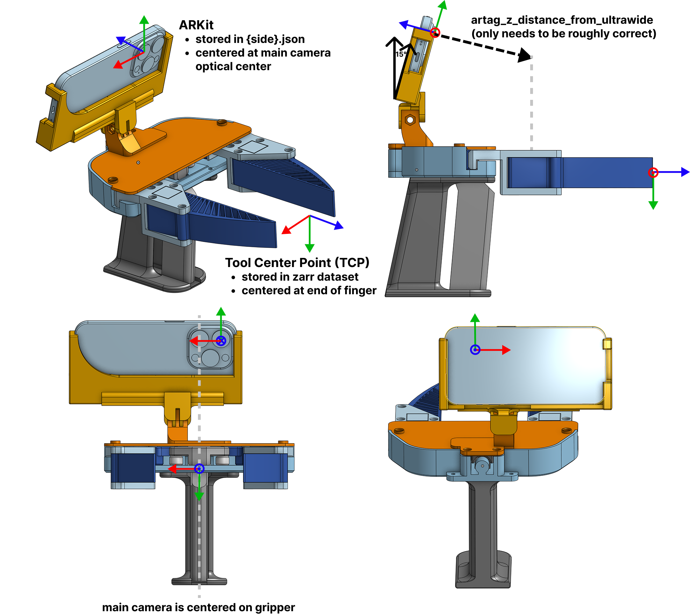

The head pose in the zarr matches the orientation of the TCP convention rather than the ARKit convention. We only use the orientation of the TCP and not the positional offset, meaning that the frame is still centered on the main camera of the iPhone like the ARKit frame is.
